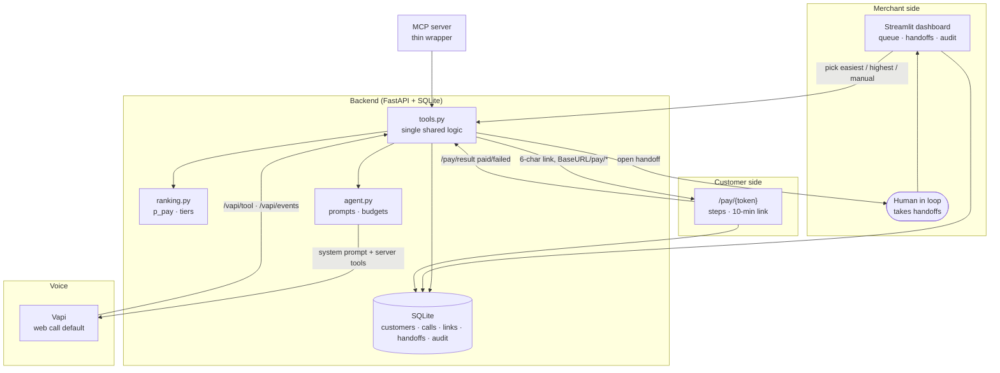

# Architecture

## Components

- `app/db.py` — schema + idempotent seed. Db path from `DATABASE_URL`,
  default `data/autopay_voice.db`. Tables: `customers`, `calls`,
  `payment_links`, `handoffs`, `audit_log`.
- `app/ranking.py` — transparent heuristic, see `ranking.md`.
- `app/tools.py` — every state change lives here. FastAPI and MCP both
  call it; nothing is duplicated. Voice tools bind `call_id`, never a
  customer id from the model.
- `app/agent.py` — prompt assembly + call decisions (tier budgets, tone,
  verification, anti-hallucination).
- `app/provider.py` — Vapi REST wrapper (web-call default, phone opt-in).
- `app/api.py` — `/pay/{token}`, `/pay/result`, Vapi webhooks.
- `app/channels.py` — link delivery adapters (console default, mock
  whatsapp/sms documented).
- `web/` — Jinja pay page + `validations.js` (pure checks) + `app.js`
  (steps, animations, backend notify).
- `dashboard/app.py` — merchant tables + human-in-the-loop queue.

## Link lifecycle

`create_payment_link()` mints 6 unambiguous chars, `expires_at = now+10min`,
`payment_status → link_sent`. Page countdown is server-synced (`expires_in`).
`POST /pay/result` with `paid` burns the link (`used_at`) and marks
`recovered`; `failed` only audits so the link stays retryable. Unknown
tokens 404 everywhere.

## Base URL

Pass the public origin explicitly (`create_payment_link(..., base_url=...)`)
so links render as `BaseURL/pay/[token]`. Local default is a relative path.
