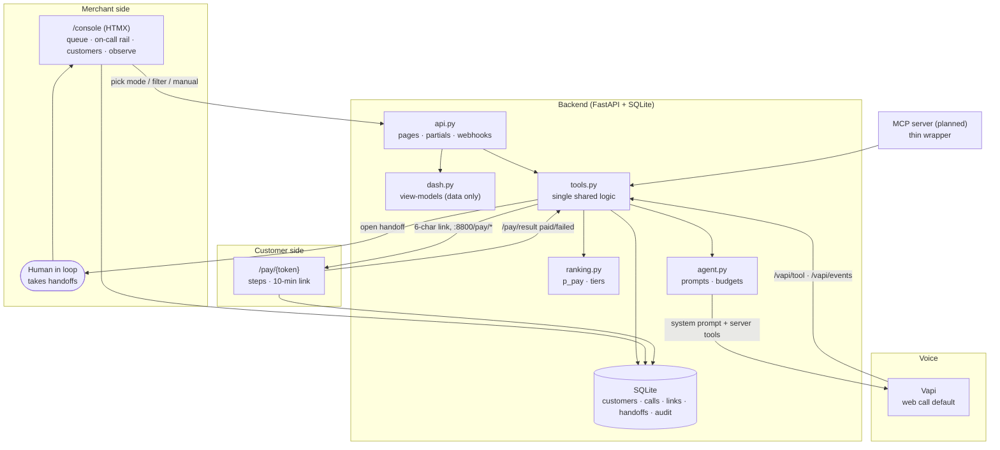
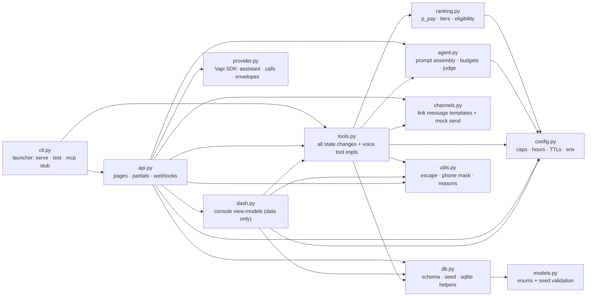

# Architecture

## App module map (click a node → source)

Reading: `cli` boots (`serve` → api, seed → tools). `api` is the hub —
it renders pages/partials from `dash` view-models, runs voice webhooks
through `tools` with `prov` parsing the envelopes, and builds call prompts
from `agentm`. `tools` owns every write: it scores via `rank`, gates hours
via `agentm`, sends links via `chan`, persists via `dbm`. `rank`/`agentm`
read limits from `config`; `dbm` validates seeds against `models`. Voice data
flow (not an import): `api` feeds `agentm`'s assembled prompt into `prov`'s
transient assistant, and `prov` parses webhook envelopes for `api`.

## Components

- `app/db.py` — schema + idempotent seed. Db path from `DATABASE_URL`,
  default `data/autopay_voice.db`. Tables: `customers`, `calls`,
  `payment_links`, `handoffs`, `audit_log`.
- `app/ranking.py` — transparent heuristic, see `ranking.md`.
- `app/tools.py` — every state change lives here. FastAPI and MCP both
  call it; nothing is duplicated. Voice tools bind `call_id`, never a
  customer id from the model.
- `app/agent.py` — prompt assembly + call decisions (tier budgets, tone,
  verification, anti-hallucination).
- `app/provider.py` — Vapi wrapper on `vapi-server-sdk` (transient assistant,
  function tools, web/phone start, webhook parsing). See `voice-provider.md`.
- `app/api.py` — console server (`app`, `:8000`: `/console`,
  `/partials/*`, Vapi webhooks `/vapi/tool` + `/vapi/events`) and pay
  server (`pay_app`, `:8800`: `/pay/test`, `/pay/{token}`,
  `/pay/result`). Same SQLite underneath.
- `app/dash.py` — console view-models, data only (no HTML).
  Markup lives in `web/partials/*.html` (Jinja components, htmx-swapped);
  `app/api.py` renders them. Phones masked, values escaped by Jinja.
- `app/channels.py` — link delivery adapters (console default, mock
  whatsapp/sms documented).
- `app/cli.py` — `autopay` launcher: serve (console on `:8000` + pay page
  on `:8800`), plus `test` and `mcp`.
- `web/console.html` — merchant console shell: KPI strips, dial bar,
  queue, on-call rail, customers, observe. Mobile: on-call first,
  bottom nav bar.
- `web/assets/console.js` — nav, ordered dial queue (localStorage),
  active-call refresh, modal.
- `web/pay.html` — customer payment page; `validations.js` (pure checks)
  + `app.js` (steps, animations, backend notify).

## Console partials

| Endpoint | Panel |
|---|---|
| `GET /partials/queue?mode=&q=&tier=` | ranked queue, checkbox per row |
| `GET /partials/active-call` | latest open call + link + handoff forms |
| `POST /partials/queue/start` | open a call for a customer |
| `POST /partials/calls/outcome` · `/cut` · `/join` | close / cut / join live call |
| `POST /partials/links` | mint + send link (binds `call_id` when on-call) |
| `POST /partials/handoffs/create` · `/resolve` | open / resolve handoff |
| `GET /partials/customers?q=&status=` + `/customers/{id}` | table + full record |
| `GET /partials/calls/{id}` | transcript + linked handoff + call audit |
| `GET /partials/calls?q=&outcome=` · `/handoffs?open=&q=` · `/audit?q=` | observe filters |

Forms post urlencoded (htmx) or JSON (tests); the server accepts both.

## Link lifecycle

`create_payment_link()` mints 6 unambiguous chars, `expires_at = now+10min`,
`payment_status → link_sent`, URL fixed to
`http://127.0.0.1:8800/pay/[token]` (pay server, `app/config.py`).
Page countdown is server-synced (`expires_in`).
`POST /pay/result` with `paid` burns the link (`used_at`) and marks
`recovered`; `failed` only audits so the link stays retryable. Unknown
tokens 404 everywhere.
